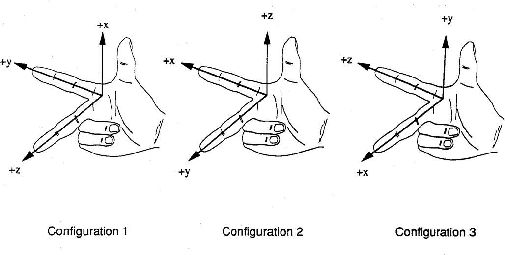

# Coordinate Systems: Right-Hand vs Left-Hand

In 3D space, the orientation of the axes ($x, y, z$) can follow one of two conventions. This choice affects the direction of operations like the **Cross Product**.

## Axis Orientation: Three-Finger Rule (Standard)
To know which axis is which, you use your right hand and follow the **Cyclic Order**:
$$
X \rightarrow Y \rightarrow Z \rightarrow X
$$

Using the **Three-Finger Rule**:
*   **Thumb:** Points along the positive $X$-axis.
*   **Index Finger:** Points along the positive $Y$-axis.
*   **Middle Finger:** Points along the positive $Z$-axis (perpendicular to your palm).

This establishes the standard right-handed space. In a left-handed space (using your left hand), your middle finger ($Z$) points in the opposite direction (away from you).

---

## Why It Matters
When working with **Cross Products** (see [[04_Cross_Product]]), the resulting vector $\vec{a} \times \vec{b}$ is defined to follow the **Right-Hand Rule**. If you are working in a Left-Handed coordinate system, your visual intuition for "up" or "forward" might be inverted compared to the mathematical result.

---

## Code Implementation

*   **C++ Source Code:** [[03_Code/02_Vectors/03_Coordinate_Systems.cppm|03_Coordinate_Systems.cppm]]
