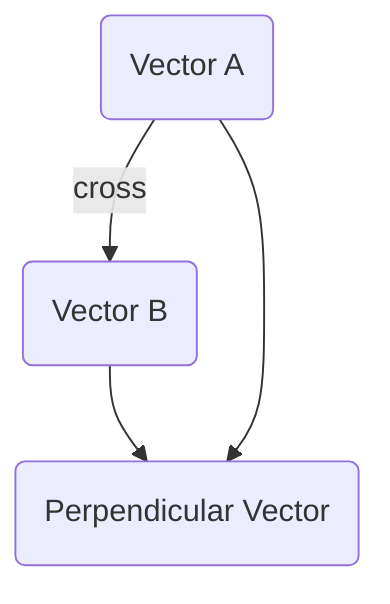

# Cross Product

The cross product of two 3D vectors is another 3D vector that is perpendicular (orthogonal) to both original vectors.

## Conceptual Understanding: "Perpendicular Generator"
Unlike the dot product which gives a number, the cross product gives a **new vector**.
- **Direction:** The result is always perpendicular to the "floor" or plane created by the two input vectors.
- **Magnitude:** The length of the resulting vector represents the **area** of the parallelogram formed by the two vectors.
- **Zero Result:** If the cross product is zero, the vectors are parallel (they don't form a plane).

## Definitions
| Type | Formula |
| :--- | :--- |
| **Algebraic** | $\vec{a} \times \vec{b} = (a_2b_3 - a_3b_2, a_3b_1 - a_1b_3, a_1b_2 - a_2b_1)$ |
| **Geometric** | $\|\vec{a} \times \vec{b}\| = \|\vec{a}\| \|\vec{b}\| \sin(\theta)$ |

## Common Applications
- **Finding Surface Normals:** In 3D modeling and physics, the cross product is used to find a vector perpendicular to a surface (a "normal").
- **Torque and Rotation:** In physics, torque is the cross product of the lever arm and the force ($\vec{\tau} = \vec{r} \times \vec{F}$).
- **Calculating Area:** Used to find the area of triangles or parallelograms in 3D space.
- **Checking Parallelism:** If the result is the zero vector, the two vectors are parallel.

## Key Properties
| Property | Formula / Description |
| :--- | :--- |
| **Anticommutative** | $\vec{a} \times \vec{b} = -(\vec{b} \times \vec{a})$ (Reversing order flips the vector) |
| **Distributive** | $\vec{a} \times (\vec{b} + \vec{c}) = \vec{a} \times \vec{b} + \vec{a} \times \vec{c}$ |
| **Vector Triple Product** | $\vec{a} \times (\vec{b} \times \vec{c}) = \vec{b}(\vec{a} \cdot \vec{c}) - \vec{c}(\vec{a} \cdot \vec{b})$ |

## Visualizing the Result (Right-Hand Rule)
- Point fingers in direction of $\vec{a}$.
- Curl fingers toward $\vec{b}$.
- Thumb points in direction of $\vec{a} \times \vec{b}$.

