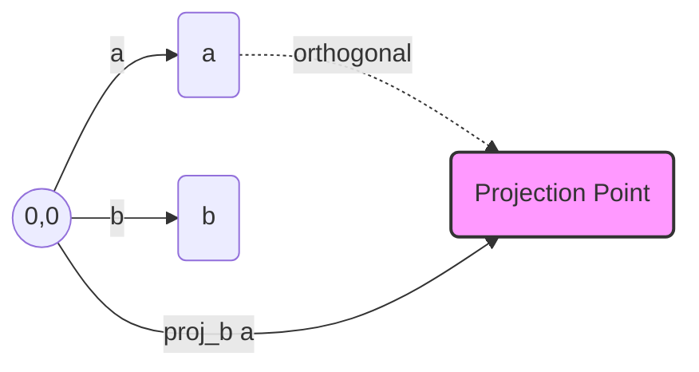

# Vector Projection

Vector projection allows us to decompose one vector into a component that lies along the direction of another vector.

## Conceptual Understanding: "Shadow and Influence"
Think of vector projection as finding the "shadow" that vector $\vec{a}$ casts onto vector $\vec{b}$.
- **What it tells us:** It tells us how much of $\vec{a}$ is acting in the same direction as $\vec{b}$.
- **Components:**
  - **Scalar Projection (Length):** Just the magnitude of the shadow.
  - **Vector Projection (Vector):** The actual vector that represents that shadow.

## Formulas
| Type | Notation | Formula |
| :--- | :--- | :--- |
| **Scalar Projection** | $\text{comp}_{\vec{b}}\vec{a}$ | $\frac{\vec{a} \cdot \vec{b}}{\|\vec{b}\|}$ |
| **Vector Projection** | $\text{proj}_{\vec{b}}\vec{a}$ | $\left( \frac{\vec{a} \cdot \vec{b}}{\|\vec{b}\|^2} \right) \vec{b}$ |

## Common Applications
- **Decomposing Forces (Physics):** Used to find how much of a force (like gravity) is acting along a specific direction (like an inclined plane).
- **Gram-Schmidt Process:** A fundamental algorithm in linear algebra used to create orthogonal bases by "removing" projections of vectors from each other.
- **Data Compression:** In machine learning (PCA), projections are used to reduce high-dimensional data into a few "principal components."
- **Collision Detection:** In game development, projections are used to determine if two objects have collided along a specific axis.

## Summary Diagram

