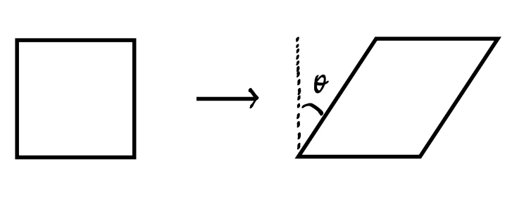
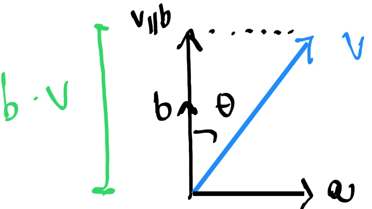
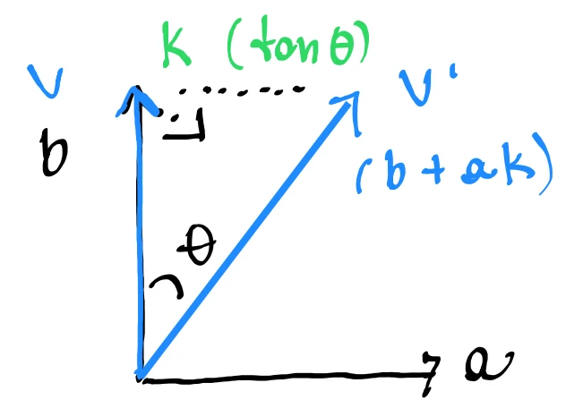

# Skew (Shear) in 3D Space

A skew (or shear) transformation is a non-rigid linear transformation that slides points parallel to a target direction by an amount proportional to their perpendicular distance from a reference axis or plane. It deforms shapes (e.g., turning a square into a parallelogram) while preserving volume.

	

---

## 1. Geometric Intuition

Geometrically, a skew transformation takes a vector $\vec{v}$ and adds a displacement vector that is parallel to a slide direction $\vec{a}$:

$$
\vec{v}' = \vec{v} + \text{Displacement Vector}
$$

To define the displacement vector, we need:
1. **Slide Direction ($\vec{a}$):** A unit vector defining the direction along which points slide.
2. **Measurement Axis ($\vec{b}$):** A unit vector perpendicular to the slide direction ($\vec{a} \cdot \vec{b} = 0$) that defines the axis along which we measure distance (or height).

	

---

## 2. Derivation of the Skew Formula

### Step 1: Measuring Height
The amount of slide is proportional to the perpendicular distance (height) from the plane perpendicular to $\vec{b}$ (often a coordinate plane). For any vector $\vec{v}$, this height is the scalar projection of $\vec{v}$ onto the unit vector $\vec{b}$:

$$
\text{height} = \text{comp}_{\vec{b}}\vec{v} = \vec{b} \cdot \vec{v}
$$

### Step 2: Scaling Factor ($k$)
The physical slide distance is proportional to the height by a scaling factor $k$:

$$
\text{Slide Distance} = k \cdot \text{height} = k(\vec{b} \cdot \vec{v})
$$

### Step 3: Displacement Vector
To turn the scalar slide distance into a physical displacement vector pointing in the direction of the unit vector $\vec{a}$, we multiply the distance by $\vec{a}$:

$$
\text{Displacement Vector} = \vec{a} k (\vec{b} \cdot \vec{v})
$$

### Step 4: Combined Algebraic Equation
Substituting the displacement vector back into the original relation:

$$
\vec{v}' = \vec{v} + k (\vec{b} \cdot \vec{v})\vec{a}
$$

---

## 3. Geometric Definition of the Scaling Factor ($k$)

To understand the relationship between $k$ and the skew angle $\theta$, consider a vector $\vec{v}$ that is initially aligned along the measurement axis $\vec{b}$ (so $\vec{v} = \vec{b}$ with unit length):

$$
\vec{v}' = \vec{b} + k (\vec{b} \cdot \vec{b})\vec{a}
$$

Since $\vec{b}$ is a unit vector ($\vec{b} \cdot \vec{b} = 1$), this simplifies to:

$$
\vec{v}' = \vec{b} + k\vec{a}
$$

This forms a right triangle where:
* The adjacent side (along $\vec{b}$) has length $\|\vec{b}\| = 1$.
* The opposite side (along the slide direction $\vec{a}$) has length $k$.
* The angle $\theta$ is the shear angle between the original axis $\vec{b}$ and the skewed vector $\vec{v}'$.

From basic trigonometry:

$$
\tan\theta = \frac{\text{opposite}}{\text{adjacent}} = \frac{k}{1} \implies k = \tan\theta
$$

Substituting $k = \tan\theta$ back into the algebraic equation gives the final skew formula:

$$
\vec{v}' = \vec{v} + (\vec{b} \cdot \vec{v})\tan\theta \, \vec{a}
$$

	

---

## 4. Transforming to Matrix Form

To represent this transformation as a single $3 \times 3$ matrix $\mathbf{M}_{\text{skew}}(\theta, \vec{a}, \vec{b})$, we convert the vector operations into matrix-vector products:

1. **Identity Matrix Substitution:** Represent the vector $\vec{v}$ using the identity matrix $\mathbf{I}$:
   $$
   \vec{v} = \mathbf{I}\vec{v}
   $$
2. **Outer Product Substitution:** Express the dot product $\vec{b} \cdot \vec{v}$ as $\vec{b}^T \vec{v}$:
   $$
   (\vec{b} \cdot \vec{v})\vec{a} = \vec{a}(\vec{b}^T\vec{v}) = (\vec{a}\vec{b}^T)\vec{v}
   $$

Substituting these back into the equation:

$$
\vec{v}' = \mathbf{I}\vec{v} + \tan\theta \, (\vec{a}\vec{b}^T)\vec{v}
$$

$$
\vec{v}' = \big(\mathbf{I} + \tan\theta \, \vec{a}\vec{b}^T\big)\vec{v}
$$

Thus, the **Skew Matrix** is defined as:

$$
\mathbf{M}_{\text{skew}}(\theta, \vec{a}, \vec{b}) = \mathbf{I} + \tan\theta \, \vec{a}\vec{b}^T = \mathbf{I} + \tan\theta \, (\vec{a} \otimes \vec{b})
$$

Where $\vec{a} \otimes \vec{b}$ represents the tensor product (equivalent to the outer product $\vec{a}\vec{b}^T$) of the two vectors.

---

## 5. Explicit Matrix Expansion

Expanding the outer product $\vec{a}\vec{b}^T$:

$$
\vec{a}\vec{b}^T = \begin{bmatrix} a_x \\\\ a_y \\\\ a_z \end{bmatrix} \begin{bmatrix} b_x & b_y & b_z \end{bmatrix} = \begin{bmatrix} a_x b_x & a_x b_y & a_x b_z \\\\ a_y b_x & a_y b_y & a_y b_z \\\\ a_z b_x & a_z b_y & a_z b_z \end{bmatrix}
$$

Multiplying by $\tan\theta$ and adding the Identity matrix yields:

$$
\mathbf{M}_{\text{skew}}(\theta, \vec{a}, \vec{b}) = \begin{bmatrix} 1 + a_x b_x \tan\theta & a_x b_y \tan\theta & a_x b_z \tan\theta \\\\ a_y b_x \tan\theta & 1 + a_y b_y \tan\theta & a_y b_z \tan\theta \\\\ a_z b_x \tan\theta & a_z b_y \tan\theta & 1 + a_z b_z \tan\theta \end{bmatrix}
$$

---

## 6. Key Properties of Skew Matrices

* **Volume Preservation:** 
  The determinant of a skew matrix is always $+1$. We can prove this algebraically using the **matrix determinant lemma**, which states that for any column vectors $\vec{u}, \vec{v}$ of the same size:
  $$
  \det(\mathbf{I} + \vec{u}\vec{v}^T) = 1 + \vec{u} \cdot \vec{v}
  $$
  Applying this lemma to our skew matrix definition $\mathbf{M}_{\text{skew}}(\theta, \vec{a}, \vec{b}) = \mathbf{I} + (\tan\theta \, \vec{a})\vec{b}^T$:
  $$
  \det\big(\mathbf{M}_{\text{skew}}(\theta, \vec{a}, \vec{b})\big) = 1 + \tan\theta \, (\vec{a} \cdot \vec{b})
  $$
  Since the slide direction $\vec{a}$ and the perpendicular measurement axis $\vec{b}$ are orthogonal ($\vec{a} \cdot \vec{b} = 0$), this simplifies to:
  $$
  \det\big(\mathbf{M}_{\text{skew}}(\theta, \vec{a}, \vec{b})\big) = 1 + \tan\theta \, (0) = 1
  $$
  This algebraic proof confirms that skew transformations are strictly volume-preserving.
* **Inverse Matrix:** 
  To undo a skew of angle $\theta$ along $\vec{a}$ relative to $\vec{b}$, we skew in the opposite direction (by $-\theta$):
  $$
  \mathbf{M}_{\text{skew}}(\theta, \vec{a}, \vec{b})^{-1} = \mathbf{M}_{\text{skew}}(-\theta, \vec{a}, \vec{b})
  $$

---
## Code Implementation

*   **C++ Source Code:** [[03_Code/04_Transforms/05_Skews.cppm|05_Skews.cppm]]
