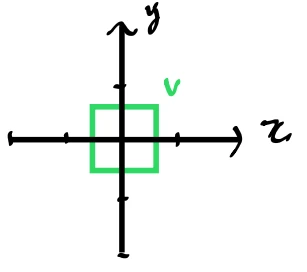
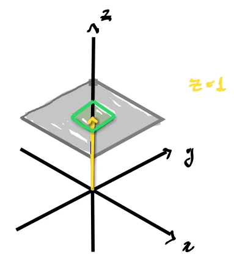
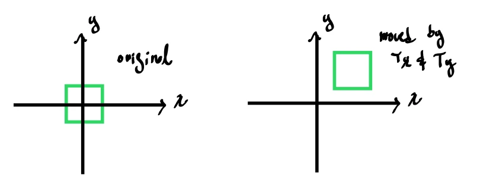
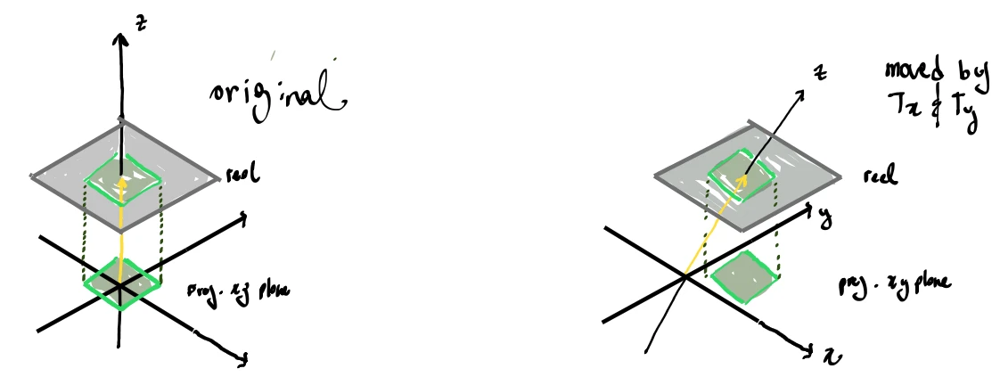

# Homogeneous Coordinates (The Solution)

In Euclidean geometry, coordinates are unique: a point in 3D space is represented by a single coordinate vector $[x, y, z]^T \in \mathbb{R}^3$. However, to represent translation and perspective projection as linear matrix operations, we must transition to **Projective Geometry** using **Homogeneous Coordinates**. 

Homogeneous coordinates represent $n$-dimensional points using $n+1$ components, mapping our 3D space into a 4-dimensional projective space ($\mathbb{P}^3$).

---

## 1. Projective Space and Equivalence Classes

In 3D projective space $\mathbb{P}^3$, a point is defined by a 4-component vector:

$$
\vec{p} = \begin{bmatrix} x \\\\ y \\\\ z \\\\ w \end{bmatrix} \quad (\text{where } w \neq 0)
$$

Unlike Euclidean space, homogeneous coordinates are characterized by **scale invariance**. Multiplying the entire coordinate vector by any non-zero scalar $k$ does not change the geometric point it represents:

$$
\begin{bmatrix} x \\\\ y \\\\ z \\\\ w \end{bmatrix} \equiv \begin{bmatrix} kx \\\\ ky \\\\ kz \\\\ kw \end{bmatrix} \quad \text{for any } k \neq 0
$$

Because of this property, a single point in 3D Euclidean space corresponds to an **entire line (ray) passing through the origin in 4D space**.

---

## 2. The Projection Screen Analogy (The $w = 1$ Plane)

With homogeneous coordinates, we can represent $n$-dimensional points using $n+1$ components. For example, we can map a 3D space to a 4-dimensional projective space ($\mathbb{P}^3$), or a 2D space to a 3-dimensional projective space ($\mathbb{P}^2$), which is much easier to visualize.

> [!NOTE]
> Normally, when projecting 3D space onto a 2D screen, we use 4D homogeneous coordinates with $w$ as the extra component. We are using $z$ as the extra component here only because it represents a 2D space embedded inside a 3D coordinate system, which is much easier to visualize.

Let's assume we have a 2D space containing a green square object $v$. Any point on $v$ can be represented using standard 2D Euclidean coordinates with $x$ and $y$ components:

	

In a homogeneous coordinate system, we can observe this 2D plane as a projection in 3D space.

Here, our 2D Euclidean world is represented as the flat gray plane $z = 1$ embedded in 3D space (where the $z$-axis acts as our homogeneous component, typically labeled $w$ in general projective systems, and the yellow line along the vertical axis highlights the $z = 1$ offset). All points of the object $v$ can still be represented by $x$ and $y$, but they now sit at the depth coordinate $z = 1$. 

For any given point $v$ in this plane:

$$
\vec{v} = \begin{bmatrix} x \\\\ y \\\\ z \end{bmatrix} \quad \text{and since } z = 1: \quad \vec{v} = \begin{bmatrix} x \\\\ y \\\\ 1 \end{bmatrix}
$$

Any 3D homogeneous coordinate $[x, y, z]^T$ represents a ray (line) passing through the origin in 3D space:

	

Geometrically, converting any point in this 3D projective space back onto our 2D plane requires us to scale it back to the 2D $x,y$ plane we defined. We accomplish this by dividing each of the vector's components by its $z$ component. This process is called **Homogeneous Division** (or perspective division):

$$
\begin{bmatrix} x \\\\ y \\\\ z \end{bmatrix} \xrightarrow{\text{Divide by } z} \begin{bmatrix} x/z \\\\ y/z \\\\ 1 \end{bmatrix}
$$

Once $z = 1$, the first two components $[x/z, y/z]^T$ represent the standard 2D Euclidean coordinates of the point on our projection plane. In our example, $z$ is already $1$, but this division mathematically projects any point along the ray (where $z \neq 1$) back onto the plane.

---

## 3. Points at Infinity ($w = 0$)

What happens if the $w$ component of a homogeneous coordinate is exactly $0$? 

If we take the limit as $w$ approaches $0$ for a point with a positive $w$:

$$
\lim_{w \to 0} \begin{bmatrix} x/w \\\\ y/w \\\\ z/w \end{bmatrix} = \infty \cdot \begin{bmatrix} x \\\\ y \\\\ z \end{bmatrix}
$$

The point moves infinitely far away along the direction vector $[x, y, z]^T$. Therefore, a homogeneous coordinate with $w = 0$:

$$
\vec{v} = \begin{bmatrix} x \\\\ y \\\\ z \\\\ 0 \end{bmatrix}
$$

represents a **Point at Infinity** (also known as an **Ideal Point**). 

### Connection to Vectors
In computer graphics, a direction vector (or velocity) has no defined position. It only has magnitude and direction. Since a point at infinity is infinitely far away, shifting it by a finite translation $\vec{t}$ has no effect on its position:

$$
\mathbf{T}(\vec{t})\vec{v} = \begin{bmatrix} 1 & 0 & 0 & t_x \\\\ 0 & 1 & 0 & t_y \\\\ 0 & 0 & 1 & t_z \\\\ 0 & 0 & 0 & 1 \end{bmatrix} \begin{bmatrix} x \\\\ y \\\\ z \\\\ 0 \end{bmatrix} = \begin{bmatrix} x \\\\ y \\\\ z \\\\ 0 \end{bmatrix}
$$

This provides the mathematical explanation for why directions (vectors) are defined with $w = 0$ and remain invariant under translation.

---

## 4. The Mathematical Bridge

Homogeneous coordinates act as a bridge that unifies different classes of transformations under a single linear algebra framework:
1.  **Linear Transformations:** Rotations, scales, reflections, and skews are represented in the upper-left $3 \times 3$ portion of the matrix.
2.  **Affine Transformations:** Translations are embedded using the 4th column.
3.  **Projective Transformations:** Perspective distortions are achieved by placing scaling values in the bottom row (which alters the $w$ component, forcing a non-uniform division by $w$).

By representing all of these operations as $4 \times 4$ matrices, they can be composed (multiplied together) into a single matrix before being applied to vertices.

---

## 5. Geometric Insight: Translation as a High-Dimensional Shear

The mathematical link between affine translations in $N$ dimensions and linear transformations in $N+1$ dimensions can be understood through **shearing (skewing)**. 

Consider the $3 \times 3$ matrix:

$$
\mathbf{H} = \begin{bmatrix} 1 & 0 & T_x \\\\ 0 & 1 & T_y \\\\ 0 & 0 & 1 \end{bmatrix}
$$

### Derivation from the General Skew Formula
We can derive this exact matrix using the general 3D skew formula from [[05_Skews.md|05_Skews]]:

$$
\mathbf{M}_{\text{skew}} = \mathbf{I} + \tan\theta \, (\vec{a}\vec{b}^T)
$$

If we define:
* **The slide direction** to be parallel to the $xy$-plane:
  
$$
\vec{a} = \begin{bmatrix} \lambda_x & \lambda_y & 0 \end{bmatrix}^T
$$
  
* **The measurement axis** to be the $z$-axis:
  
$$
\vec{b} = \begin{bmatrix} 0 & 0 & 1 \end{bmatrix}^T
$$

The outer product of these two vectors is:

$$
\vec{a}\vec{b}^T = \begin{bmatrix} \lambda_x \\\\ \lambda_y \\\\ 0 \end{bmatrix} \begin{bmatrix} 0 & 0 & 1 \end{bmatrix} = \begin{bmatrix} 0 & 0 & \lambda_x \\\\ 0 & 0 & \lambda_y \\\\ 0 & 0 & 0 \end{bmatrix}
$$

Substituting this into the general skew matrix formula yields:

$$
\mathbf{H} = \mathbf{I} + \tan\theta \, (\vec{a}\vec{b}^T) = \begin{bmatrix} 1 & 0 & \lambda_x \tan\theta \\\\ 0 & 1 & \lambda_y \tan\theta \\\\ 0 & 0 & 1 \end{bmatrix}
$$

By setting the shear displacement amounts in the $x$ and $y$ directions to $T_x = \lambda_x \tan\theta$ and $T_y = \lambda_y \tan\theta$, we arrive precisely at our matrix $\mathbf{H}$.

Depending on how you interpret the vectors it acts upon, this matrix has two identical algebraic but distinct geometric meanings:

### 1. In 2D Homogeneous Coordinates ($w=1$): 2D Translation
It represents a **2D Translation** by the vector $[T_x, T_y]^T$:

$$
\begin{bmatrix} 1 & 0 & T_x \\\\ 0 & 1 & T_y \\\\ 0 & 0 & 1 \end{bmatrix} \begin{bmatrix} x \\\\ y \\\\ 1 \end{bmatrix} = \begin{bmatrix} x + T_x \\\\ y + T_y \\\\ 1 \end{bmatrix}
$$

	

### 2. In 3D Euclidean Coordinates: 3D Shear (Skew)
It represents a **3D Shear (Skew)** transformation along the $xy$-plane, where the shear displacement is proportional to the $z$ coordinate:

$$
\begin{bmatrix} 1 & 0 & T_x \\\\ 0 & 1 & T_y \\\\ 0 & 0 & 1 \end{bmatrix} \begin{bmatrix} x \\\\ y \\\\ z \end{bmatrix} = \begin{bmatrix} x + T_x z \\\\ y + T_y z \\\\ z \end{bmatrix}
$$

Here, points are shifted parallel to the $x$-axis by $T_x \cdot z$ and parallel to the $y$-axis by $T_y \cdot z$.

	

Just as this 3D example uses the extra vertical axis ($z$) to perform a 2D translation via a 3D shear, the exact same principle applies when translating an object in **3D space**: we lift our 3D coordinates into a 4-dimensional projective space ($\mathbb{P}^3$) and use the 4th dimension ($w$) to translate them. Although we cannot geometrically visualize this 4D space, the mathematics is identical—our 3D Euclidean world is represented as the hyperplane $w = 1$ in 4D space, and we translate our 3D objects using 4D linear matrix operations.

### The Equivalence
This equivalence is the fundamental secret of homogeneous coordinates: **a translation in $N$ dimensions is mathematically identical to a shear transformation in $(N+1)$-dimensional space.**

By lifting our 3D coordinates to 4D projective space and fixing the last coordinate to $w = 1$, we convert a non-linear translation into a linear shear transformation in the higher dimension.

---

## References & Resources

*   **YouTube Video:** [Quick Understanding of Homogeneous Coordinates for Computer Graphics](https://www.youtube.com/watch?v=o-xwmTODTUI)
*   **YouTube Video:** [4D Thinking for 3D Graphics](https://www.youtube.com/watch?v=naatDSe6v1c)

---

## Code Implementation

*   **C++ Source Code:** [[03_Code/04_Transforms/07_Homogeneous_Coordinates.cppm|07_Homogeneous_Coordinates.cppm]]
