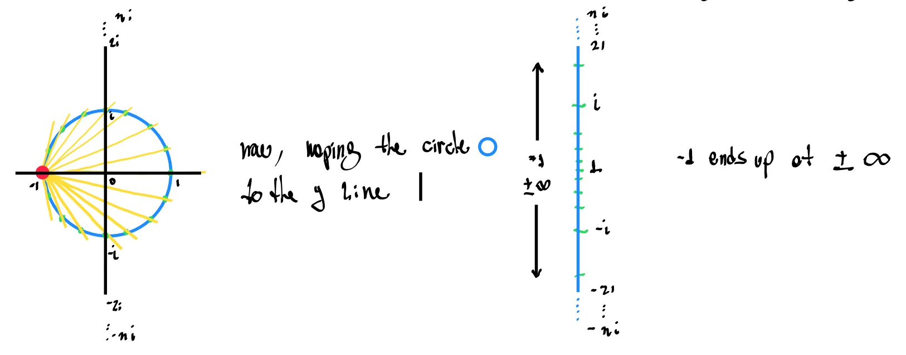
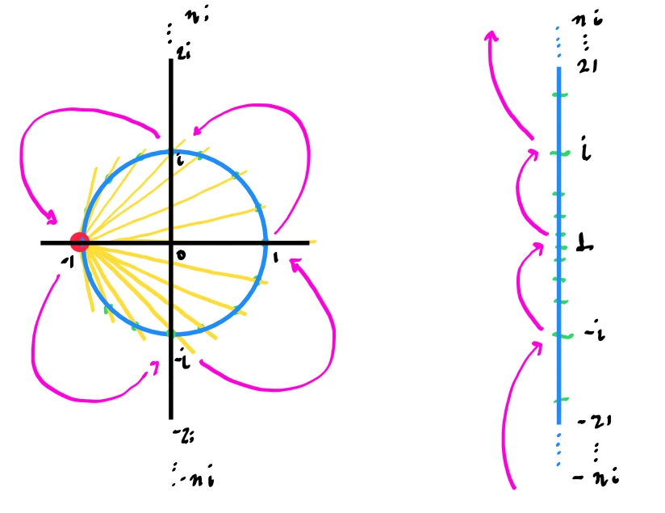
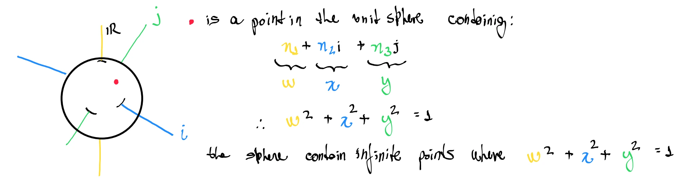
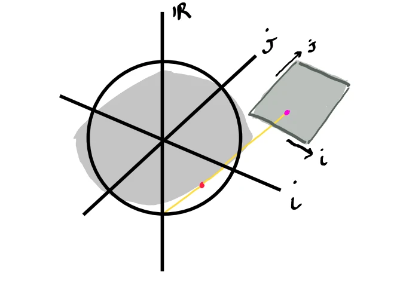
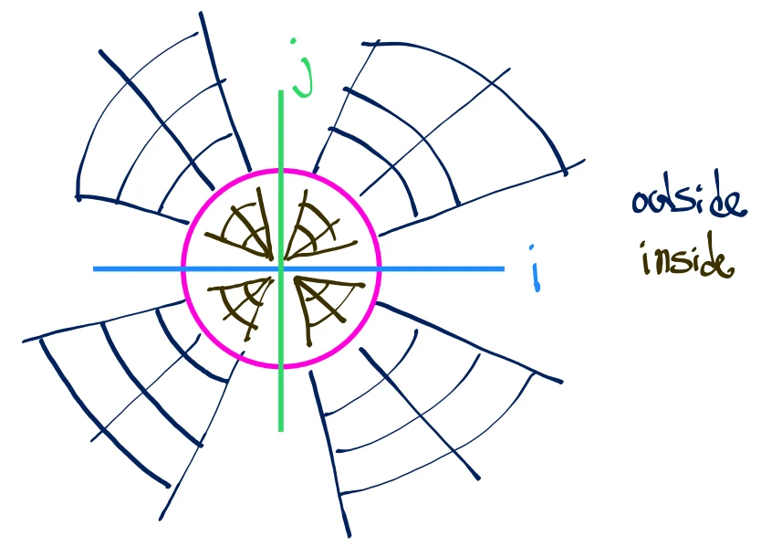

# Quaternion Intuition: Dimensional Projections

Quaternions are a four-dimensional extension of complex numbers. While complex numbers extend the real numbers into a 2D plane ($\mathbb{C} = \mathbb{R} + i\mathbb{R}$), quaternions extend them into a 4D space ($\mathbb{H} = \mathbb{R} + i\mathbb{R} + j\mathbb{R} + k\mathbb{R}$). 

In graphics programming, game engines, physics simulations, and robotics, quaternions are the industry standard for representing 3D rotations. They are preferred over rotation matrices and Euler angles because they are compact (using only 4 numbers instead of 9, from a 3x3 matrix), interpolate smoothly (via SLERP), and completely avoid **Gimbal Lock**.

To acquire the intuition for quaternions, we will make use of **dimensional projections**. Because we cannot see in 4D, we will start in 2D, project onto 1D, and scale up one dimension at a time until the 4D math becomes clear and tangible.

---

## 1. Geometric Intuition: Dimensional Projections

Since we cannot perceive four dimensions directly, we must project 4D geometry down into our 3D world. The mathematical tool we use for this is **Stereographic Projection**. 

Think of stereographic projection like placing a light source at the pole of a sphere and projecting its surface onto a flat plane (just like projecting a 3D globe onto a 2D flat paper map). This mapping is **conformal** (angle-preserving), which is crucial for rotations: it means circles and spheres in higher dimensions project to clean circles, spheres, or straight lines in lower dimensions.

By studying how rotations in lower dimensions project to even lower dimensions, we can build a visual toolkit to understand how 4D rotations behave in our 3D space.

### 1D Projection (Rotating a 2D Circle onto a Line)

We start with a 2D unit circle (a 1-sphere, $S^1$) because it is the simplest possible case of stereographic projection. It lets us see how a 2D rotation projects to a flow along a 1D line.

Consider the circle sitting in a 2D plane defined by a real horizontal axis $w$ and an imaginary vertical axis $i$. The circle represents all complex numbers $z = w + xi$ with magnitude $\|z\| = 1$ (so $w^2 + x^2 = 1$). 

We project this circle onto the vertical 1D imaginary axis (the line $w = 0$) using a projection source (the red dot) at the "south pole" $(-1, 0)$, representing the point $-1$ on the real axis:
1. Draw a straight line from the projection source $(-1, 0)$ through any point $(w, x)$ on the circle.
2. The intersection of this line with the vertical axis ($w = 0$) is the stereographic projection of that point.

  <!-- Placeholder for 1D Projection Diagram: mapping_circle_to_line.webp -->
  

Algebraically, the stereographic projection $p$ of a point $w + xi$ is given by:

$$
p = \frac{x}{w + 1}i
$$

Under this mapping, specific reference points on the circle project as follows:
*   **The point $+1$ ($w = 1, x = 0$):** Projects to the origin ($0$) in the center of the vertical line (labeled as `1` in the diagram to denote the projection of the point $+1$).
*   **The point $i$ ($w = 0, x = 1$):** Projects to the point $i$ on the line.
*   **The point $-i$ ($w = 0, x = -1$):** Projects to the point $-i$ on the line.
*   **The point $-1$ ($w = -1, x = 0$):** Since this is the projection source, the projection line is horizontal and parallel to the vertical axis, projecting it to infinity ($\pm\infty$).

#### Visualizing Rotation as a Continuous Flow
If we rotate the circle counterclockwise (corresponding to successive multiplications by $i$: $1 \to i \to -1 \to -i \to 1$), we can watch how the projected points flow along the 1D line:

  <!-- Placeholder for 2D Projection Diagram: rotating_2D_streographic_projection.webp -->
  

1. A point starting at the center (the projection of $+1$) flows **upwards** towards $i$.
2. As the circle continues to rotate towards $-1$, the projected point moves rapidly upwards past $i$ towards $+\infty$.
3. As the point on the circle crosses the south pole $-1$, its projection wraps around from $+\infty$ to $-\infty$.
4. The projected point then continues flowing upwards from $-\infty$ through $-i$, eventually returning to the center $0$.

Thus, a closed 2D rotation of the circle corresponds to a continuous, upward flow along the 1D line that wraps around at infinity.

### 2D Projection (Rotating a 3D Sphere onto a Plane)

We scale this concept up by projecting a 3D unit sphere (a 2-sphere, $S^2$) onto a 2D plane. Let the sphere be defined by $w^2 + x^2 + y^2 = 1$ in a 3D coordinate system where:
*   The vertical axis is the real axis ($w$, representing the scalar component).
*   The horizontal axes are the imaginary axes ($i$ and $j$, representing the vector components).

We project the sphere from the south pole $S = -1$ (the point $(-1, 0, 0)$ where the real component $w = -1$) onto the horizontal $ij$-plane ($w = 0$).

As illustrated in the coordinates breakdown diagram below:

  <!-- Placeholder for 2D Projection Diagram: mapping_sphere_to_plane_1.webp -->
  

1. Draw a line from the projection source $(-1, 0, 0)$ through any point $(w, x, y)$ on the sphere.
2. The intersection of this line with the $ij$-plane is its projected point.

  <!-- Placeholder for 2D Projection Diagram: mapping_sphere_to_plane.webp -->
  

Algebraically, the projection of a sphere point $q = w + xi + yj$ onto the $ij$-plane is:

$$
p = \frac{x}{w + 1}i + \frac{y}{w + 1}j
$$

Looking at the $ij$-plane from above, this projection divides the sphere into three distinct regions:
*   **The Equator ($w = 0$):** The equator contains the imaginary unit coordinates ($i, j, -i, -j$). Since $w = 0$, the projection simplifies to $p = xi + yj$, meaning the equator projects exactly onto the unit circle in the plane, staying fixed in place (the pink circle in the diagram).
*   **The Northern Hemisphere ($w > 0$):** Because $w > 0$, the scaling factor $\frac{1}{w+1}$ is less than $1$. This compresses the hemisphere containing the north pole $+1$ entirely **inside** the unit circle. The north pole $+1$ itself projects directly to the origin.
*   **The Southern Hemisphere ($w < 0$):** Because $w < 0$, the scaling factor $\frac{1}{w+1}$ is greater than $1$. This stretches the hemisphere containing the south pole $-1$ entirely **outside** the unit circle, with the south pole $-1$ projecting to infinity.

  <!-- Placeholder for 2D Projection Diagram: mapping_sphere_to_plane_3.webp -->
  

#### Visualizing Sphere Rotations
*   **Rotation around the Real Axis ($w$):** Since this rotation occurs entirely within the horizontal $ij$-plane, it projects to a simple, un-warped 2D rotation of the $ij$-plane around the origin.
*   **Rotation around an Axis in the $ij$-Plane:** This rotation mixes the real component $w$ with the imaginary components $x$ and $y$. On the plane, the projected coordinate grid (latitude and longitude lines) warps, compressing towards the origin as points rotate towards the north pole, and expanding outwards to infinity as they rotate towards the south pole.

#### Visualizing Sphere Rotations as a Flow on Coordinate Axes
To see how a 3D rotation corresponds to our 1D continuous flow, we can look at the two coordinate axes (the horizontal $i$-axis and the vertical $j$-axis) in the projection plane:

  <!-- Placeholder for Sphere to Line Projection Diagram: mapping_sphere_to_line.webp -->
  

Each axis behaves as an independent 1D projection line for rotations in its corresponding plane:
*   **Rotation in the $wi$-plane (around the $j$-axis):** This rotation leaves the $j$ component unchanged ($y = 0$). Points on the circle $w^2 + x^2 = 1$ project directly onto the horizontal $i$-axis (green circle on the sphere). As the sphere rotates, the projected coordinates flow along the horizontal $i$-axis: starting at the center ($1$, projection of $+1$), moving right through $i$, wrapping around at $\pm\infty$ on the $i$-axis, and flowing back from $-\infty$ through $-i$ to the center.
*   **Rotation in the $wj$-plane (around the $i$-axis):** This rotation leaves the $i$ component unchanged ($x = 0$). Points on the circle $w^2 + y^2 = 1$ project directly onto the vertical $j$-axis (red circle on the sphere). The projected coordinates flow along the vertical $j$-axis: starting at the center ($1$, projection of $+1$), moving up through $j$, wrapping at $\pm\infty$ on the $j$-axis, and flowing back from $-\infty$ through $-j$ to the center.

Thus, the 2D projection plane is formed by two perpendicular 1D projection lines, where rotations in the orthogonal planes project to wrapping flows along the $i$ and $j$ axes.

### 3D Projection (Rotating a 4D Hypersphere onto 3D Space)

By extension, a quaternion represents a point on a 4D unit hypersphere (a 3-sphere, $S^3$), defined by:
*   $w^2 + x^2 + y^2 + z^2 = 1$ in a 4D space with one real axis $w$ and three imaginary axes $i, j, k$.

We can visualize 4D rotations of this hypersphere by stereographically projecting it from the pole $w = -1$ (the point $(-1, 0, 0, 0)$) onto our 3D space (the $ijk$-space, where $w = 0$).

Algebraically, the projection of a quaternion $q = w + xi + yj + zk$ is:

$$
p = \frac{x}{w + 1}i + \frac{y}{w + 1}j + \frac{z}{w + 1}k
$$

Under this projection:
*   **The 3D Equator ($w = 0$):** The set of points where the real component is zero forms a 3D unit sphere ($x^2 + y^2 + z^2 = 1$). This projects exactly onto the 3D unit sphere in our space, staying fixed.
*   **The Hyper-hemisphere containing $+1$ ($w > 0$):** Projects entirely **inside** our 3D unit sphere, with $+1$ mapping to the origin.
*   **The Hyper-hemisphere containing $-1$ ($w < 0$):** Projects entirely **outside** our 3D unit sphere, with $-1$ mapping to infinity.

As the 4D hypersphere rotates:
*   Rotations that only mix $i, j, k$ (leaving the real component $w$ unchanged) project to pure 3D rotations of our space.
*   Rotations that mix the real component $w$ with the imaginary components cause our 3D space grid to warp, expanding from the origin and stretching out to infinity or compressing inwards.

#### Visualizing Hypersphere Rotations as a Flow in 3D Space
Just as a 3D sphere rotation projects to flows on coordinate axes in a 2D plane, a 4D hypersphere rotation projects to combined flows and rotations inside our 3D space. 

Consider pre-multiplying a 3D projected point $p$ by the imaginary unit $i$ (representing a 4D rotation by $90^\circ$ in the $wi$-plane and $jk$-plane):

  <!-- Placeholder for Hypersphere to Sphere Projection Diagram: mapping_hypersphere_to_sphere_3.webp -->
  

Under this multiplication ($i \cdot p$), we can trace the geometric action on our 3D space (shown in the box in the diagram):
*   **Along the $i$-axis (mixing real $w$ and imaginary $i$):** 
    *   $i \cdot 1 = i$
    *   $i \cdot i = -1$ (which maps to infinity)
    *   This is the exact same continuous 1D flow we saw in the circle case. Points flow along the horizontal $i$-axis (the yellow/green line in the diagram): starting at the origin $1$, passing through $i$, wrapping around at infinity (which represents the south pole $-1$), and returning through $-i$.
*   **In the perpendicular $jk$-plane (mixing imaginary $j$ and $k$):**
    *   $i \cdot j = k$
    *   $i \cdot k = -j$
    *   This is a pure 2D rotation of the $jk$-plane (the red/blue circle in the diagram) around the $i$-axis by $90^\circ$. The points simply rotate along it without any warping.

Thus, a 4D rotation around the $i$-axis projects to our 3D space as a simultaneous **linear wrapping flow** along the $i$-axis, and a **pure 2D rotation** in the perpendicular $jk$-plane.

---

## 2. Physical Interpretation: The Axis-Angle Connection in 3D

When we transition from 4D geometry to practical 3D applications, a unit quaternion $q = w + xi + yj + zk$ is interpreted physically as an **axis of rotation** and a **rotation value**.

*   **The Rotation Axis ($i, j, k$):** The three imaginary components $i, j, k$ correspond to the coordinate axes of the 3D axis around which the rotation occurs. In our 3D visual representations:
    *   **$i$-axis (blue):** Horizontal axis (pointing right).
    *   **$j$-axis (green):** Diagonal axis (pointing depth-wise).
    *   **$k$-axis (yellow):** Vertical axis (pointing straight up).
    
    This rotation axis is represented mathematically by a normalized 3D unit vector:

$$
\vec{u} = [u_x, u_y, u_z]^T \quad (\text{where } \|\vec{u}\| = 1)
$$

*   **The Rotation Value ($w$):** The real scalar component $w$ encodes the amount of rotation.

### 1. Setting the Axis of Rotation
By setting the values of the imaginary components $i$, $j$, and $k$, we define the direction of the rotation vector (drawn as a pink double-headed arrow):

*   **Pure $i$-Axis Rotation ($i=1, j=0, k=0$):**  
    Creates a rotation vector aligned with the horizontal $i$-axis (pointing right).
    

      <!-- Placeholder: quaternion_rotation_axis_i.webp -->
      
    

*   **Pure $j$-Axis Rotation ($i=0, j=1, k=0$):**  
    Creates a rotation vector aligned with the diagonal $j$-axis (pointing depth-wise).
    

      <!-- Placeholder: quaternion_rotation_axis_j.webp -->
      
    

*   **Pure $k$-Axis Rotation ($i=0, j=0, k=1$):**  
    Creates a rotation vector aligned with the vertical $k$-axis (pointing straight up).
    

      <!-- Placeholder: quaternion_rotation_axis_k.webp -->
      
    

*   **Arbitrary Axis Rotation (e.g., $i=-1, j=-1, k=1$):**  
    Creates a diagonal rotation vector pointing in 3D space (specifically pointing left, backward, and up, as shown in the diagram).
    

      <!-- Placeholder: quaternion_rotation_axis_arbitrary.webp -->
      
    

### 2. The Right-Hand Rule
When you change the real component $w$, the object rotates around the rotation vector following the **right-hand rule**:
*   Imagine "grabbing" the rotation vector with your right hand such that your thumb points in the direction the vector is pointing.
*   A positive $w$ rotation ($w > 0$) rotates the object in the same direction that your fingers naturally curl around the vector.
*   For example, for a rotation around the $i$-axis ($i=1, j=0, k=0$) with $w > 0$, the object rotates around the horizontal axis in the direction shown by the green circular arrows:

  <!-- Placeholder: quaternion_right_hand_rule.webp -->
  

### 3. Normalization Requirement
For the rotation to be mathematically valid and useful, the 3D rotation vector must always be **normalized** to a length of 1 ($\|\vec{u}\| = 1$) before applying the rotation.
*   If we set un-normalized values (e.g., $i=-1, j=-1, k=1$), the vector length is:

$$
\|\vec{u}\| = \sqrt{(-1)^2 + (-1)^2 + 1^2} = \sqrt{3} \approx 1.732
$$

*   To normalize this vector, we must divide each component by the length, mapping it onto the 3D unit sphere:

$$
\vec{u}_{\text{normalized}} = \left[-\frac{1}{\sqrt{3}}, -\frac{1}{\sqrt{3}}, \frac{1}{\sqrt{3}}\right]^T \approx [-0.577, -0.577, 0.577]^T
$$

---

## References & Additional Resources

*   **Ben Eater & Grant Sanderson (3Blue1Brown) - Quaternions Interactive Visualizations:** [eater.net/quaternions](https://eater.net/quaternions)
*   **How to Use Quaternions:** [youtube.com/watch?v=bKd2lPjl92c](https://www.youtube.com/watch?v=bKd2lPjl92c)
*   **Godot's quaternion variant is beautiful (and misunderstood):** [youtube.com/watch?v=Ri2xIhcii8I](https://www.youtube.com/watch?v=Ri2xIhcii8I)
