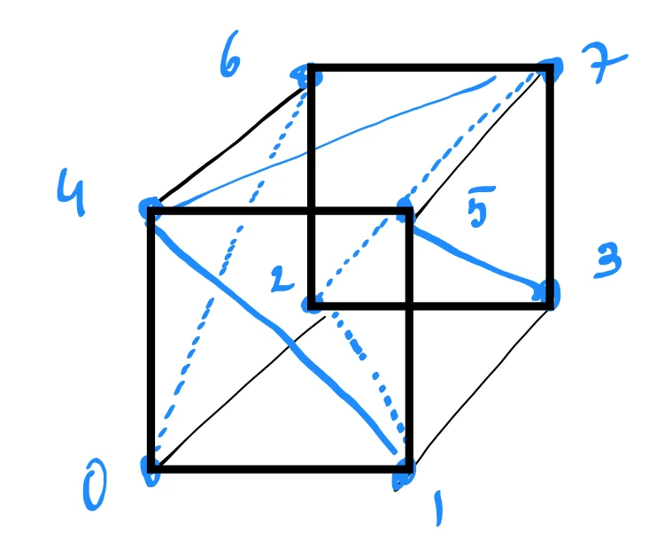

# Triangle Meshes

Objects drawn by a game engine are composed of triangles. A **triangle mesh** is a collection of triangles that fit together to model the surface of a solid volume.

---

## Why Triangles?

Each face of a 3D shape (such as a box) is composed of 2 triangles.

	

This is done because hardware cannot process polygons with more than 3 sides. There is always a way of breaking any polygon into triangles — this process is called **triangulation**.

---

## Mesh Structure

Each vertex in a mesh is shared by multiple triangles.

---

## Closed Triangle Meshes and Euler's Formula

A triangle mesh is called **closed** (watertight) if every edge is used by **exactly 2 triangles**.

### Basic Euler Formula (No Holes)

For simple closed shapes without any holes passing through them (topologically equivalent to a sphere or a box), the number of vertices ($V$), edges ($E$), and faces ($F$) satisfies:

$$
V - E + F = 2
$$

**Example (Triangulated Box):**
A box has $V = 8$ vertices, $E = 18$ edges, and $F = 12$ triangular faces:

$$
8 - 18 + 12 = 2
$$

---

### General Euler-Poincaré Formula (Shapes with Holes)

If a closed 3D shape has **through-holes** (like a donut or a coffee mug handle, mathematically called the **genus** $g$), the formula changes. The general formula for a closed surface with $g$ holes is:

$$
V - E + F = 2 - 2g
$$

where:
* **$g$** is the number of through-holes (genus) in the solid shape.

#### Examples:
* **Sphere / Box ($g = 0$ holes):**
  
  $$
  V - E + F = 2 - 2(0) = 2
  $$

* **Torus / Donut ($g = 1$ hole):**
  
  $$
  V - E + F = 2 - 2(1) = 0
  $$

* **Double Donut ($g = 2$ holes):**
  
  $$
  V - E + F = 2 - 2(2) = -2
  $$

---

### Open Meshes (Boundary Cutouts)

If the mesh is **open** (it has missing faces or open boundaries, such as a hollow tube open at both ends), we also subtract the number of open boundary loops ($h$):

$$
V - E + F = 2 - 2g - h
$$

where:
* **$h$** is the number of open boundary loops in the mesh.

---

## Code Implementation

* **C++ Source Code:** [[03_Code/05_Geometry/Triangle_Meshes.cppm|Triangle_Meshes.cppm]]
