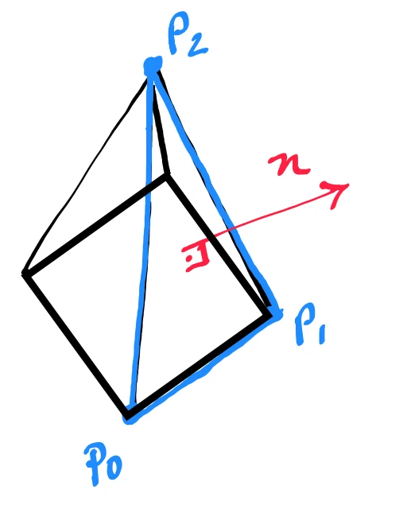
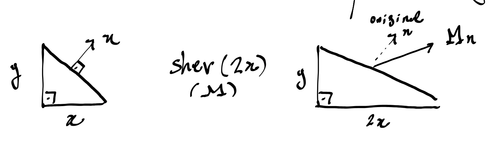

# Normal Vectors

A **normal vector** is a vector that points orthogonally outwards from a surface. Normal vectors are usually scaled down to **unit vectors**.

---

## Calculating Normal Vectors

There are multiple ways of calculating normal vectors, but the best approach depends on how a surface is mathematically described.

The normal vector $\vec{n}$ for a triangular face having vertices $P_0$, $P_1$, and $P_2$ is given by the [[04_Cross_Product|cross product]] between vectors corresponding to two vertices of the triangle:

$$
\vec{n} = (P_1 - P_0) \times (P_2 - P_0)
$$

	

---

## Transforming Normal Vectors

When an object is transformed by a transformation matrix $\mathbf{M}$, there is no guarantee that the normal vector will be transformed correctly by $\mathbf{M}$ — that is, it may no longer be orthogonal to its edge and/or pointing in the right direction.

### Example: Shearing

Let's take an example of shearing only on the $x$-axis ($y$ stays the same):

	

As we can see, neither the original normal $\vec{n}$ nor $\mathbf{M}\vec{n}$ is orthogonal to the sheared edge.

---

### Rotations and Translations

When translating and/or rotating, the object is not physically altered, which means we can use the matrix directly. Especially for rotating, since translating the object does not change vector directions at all:

$$
\vec{n}_B = \mathbf{M} \vec{n}_A
$$

---

### Scaling and Shearing

For scaling (shearing), we accomplish an orthogonal normal vector by multiplying it by the **inverse of the transpose** of the transformation matrix:

$$
\vec{n}_B = (\mathbf{M}^{-1})^T \vec{n}_A
$$

**Intuition:** If for example a transformation matrix scales $x$ by a factor of $2$, the normal vector needs to be scaled by a factor of $0.5$ along $x$ to maintain its orthogonality.

---

### Reflection

For reflection, the same formula above applies, with **one difference**:

When an object is reflected, all its components are mirrored, which means that they invert their direction. If we only apply $\vec{n}_B = (\mathbf{M}^{-1})^T \vec{n}_A$, it will end up with a normal vector pointing in the **opposite direction** of the newly reflected object.

To fix this, we can take the [[03_Determinants|determinant]] of the reflection matrix and multiply the transformed vector by its sign:

$$
\vec{n}_B = \text{sign}(\det(\mathbf{M})) (\mathbf{M}^{-1})^T \vec{n}_A
$$

---

### Re-normalization

In either case, shearing or reflecting the normal vector will **not** preserve its dimensions (if it was a unit vector before, it won't be after the transformation). 

For that, we need to **re-normalize** the normal vectors after the transformation is applied.

---

## Code Implementation

* **C++ Source Code:** [[03_Code/05_Geometry/Normal_Vectors.cppm|Normal_Vectors.cppm]]
