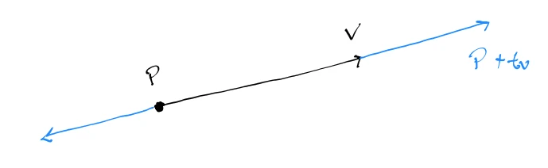
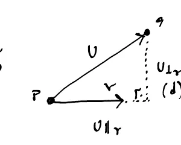
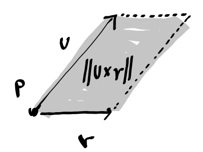
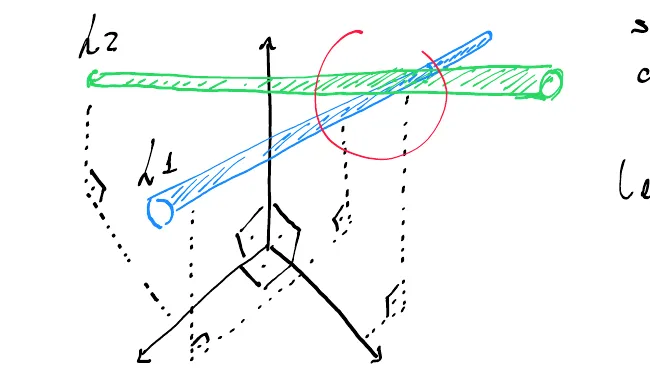
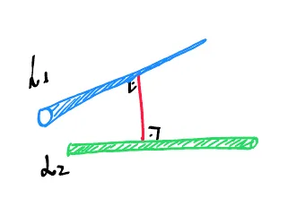

# Lines and Rays

Lines and rays are basically the same thing mathematically, with one distinction: a **line** extends to infinity in both ends, while a **ray** starts at one point and then extends to infinity in one direction.

---

## Parametric Lines

A **parametric line** is a line whose points are expressed as functions of a single parameter.

$$
L(t) = (1 - t) P_1 + t P_2
$$

When $0 \le t \le 1$, the line bounds exactly at the segment connecting $P_1$ and $P_2$, where $P_1$ and $P_2$ are two points. Otherwise, the points fall elsewhere on the line extending to infinity.

The formula can be rewritten as:

$$
L(t) = P + t \mathbf{v}
$$

where:
* **$L(t)$** is the position on the line at any point $t$.
* **$P$** is a known point on the line.
* **$t \in \mathbb{R}$** is a scalar parameter.
* **$\mathbf{v} = \langle a, b, c \rangle$** is the direction vector parallel to the line.

	

---

## Distance Between a Point and a Line

To find the shortest distance $d$ from a point $q$ to a line defined by $P + t \mathbf{v}$, we first construct the vector $\mathbf{u}$ from $P$ to $q$:

$$
\mathbf{u} = q - P
$$

Geometrically, $d$ can be found directly without squaring. However, textbook formulas often start with $d^2$ or use a single large square root due to Pythagorean relations and code performance optimizations.

---

### Method 1: Rejection & Pythagorean Formula

The distance $d$ is equal to the magnitude of the [[06_Vector_Projection|rejection vector]] of $\mathbf{u}$ from $\mathbf{v}$:

$$
d = \|\mathbf{u} - \text{proj}_{\mathbf{v}}\mathbf{u}\|
$$

Because the projection, rejection, and hypotenuse $\mathbf{u}$ form a right triangle, the **Pythagorean theorem** ($a^2 + b^2 = c^2$) gives:

$$
\|\mathbf{u}\|^2 = u_{\|r}\|^2 + u_{\perp r}^2 \implies d^2 = u^2 - u_{\|r}\|^2
$$

Substituting the projection $u_{\|r} = \frac{\mathbf{u} \cdot \mathbf{v}}{v^2}\mathbf{v}$:

$$
d^2 = u^2 - \frac{(\mathbf{u} \cdot \mathbf{v})^2}{v^2} \implies d = \sqrt{u^2 - \frac{(\mathbf{u} \cdot \mathbf{v})^2}{v^2}}
$$

	

---

### Method 2: Parallelogram Area / Base Formula

Geometrically, the area of the parallelogram formed by $\mathbf{u}$ and $\mathbf{v}$ ([[04_Cross_Product|cross product]]) is $\text{Area} = \text{base} \times \text{height} = \|\mathbf{v}\| \times d$. 

Rearranging directly yields the un-squared formula for $d$:

$$
d = \frac{\|\mathbf{u} \times \mathbf{v}\|}{\|\mathbf{v}\|}
$$

	

#### Performance Note (Code Optimization):
Calculating vector magnitudes in computer graphics requires `sqrt()`, which is a slow hardware instruction. Computing $\|\mathbf{u} \times \mathbf{v}\| / \|\mathbf{v}\|$ directly requires **two separate `sqrt()` calls**. Keeping terms squared inside a single radical reduces this to a **single `sqrt()` call** at the very end:

$$
d = \sqrt{\frac{(\mathbf{u} \times \mathbf{v})^2}{v^2}}
$$

---

## Distance Between 2 Lines

In 3D space, 2 lines that do not lie in the same plane are called **skew lines**. Skew lines are not parallel, and they do not intersect, but at one point they come closest to each other.

	

Let the two lines be described by the parametric functions:

$$
L_1(t_1) = P_1 + t_1 \mathbf{v}_1, \qquad L_2(t_2) = P_2 + t_2 \mathbf{v}_2
$$

---

### Finding the Minimum Distance for Skew Lines

The minimum distance between two skew lines occurs along a 3rd line connecting them that is **orthogonal to both $L_1$ and $L_2$**.

	

Finding the parameters $t_1$ and $t_2$ that yield the common orthogonal connecting vector gives the minimum distance:

$$
d = \|L_2(t_2) - L_1(t_1)\|
$$

We can express the orthogonality requirement using [[02_Dot_Product|dot products]] with both direction vectors $\mathbf{v}_1$ and $\mathbf{v}_2$:

$$
\begin{cases}
(L_2(t_2) - L_1(t_1)) \cdot \mathbf{v}_1 = 0 \\
(L_2(t_2) - L_1(t_1)) \cdot \mathbf{v}_2 = 0
\end{cases}
$$

Substituting the line equations:

$$
\begin{cases}
(P_2 + t_2 \mathbf{v}_2 - P_1 - t_1 \mathbf{v}_1) \cdot \mathbf{v}_1 = 0 \\
(P_2 + t_2 \mathbf{v}_2 - P_1 - t_1 \mathbf{v}_1) \cdot \mathbf{v}_2 = 0
\end{cases}
$$

Rearranging into matrix form:

$$
\begin{bmatrix} \mathbf{v}_1^2 & -\mathbf{v}_1 \cdot \mathbf{v}_2 \\ \mathbf{v}_1 \cdot \mathbf{v}_2 & -\mathbf{v}_2^2 \end{bmatrix} \begin{bmatrix} t_1 \\ t_2 \end{bmatrix} = \begin{bmatrix} (P_2 - P_1) \cdot \mathbf{v}_1 \\ (P_2 - P_1) \cdot \mathbf{v}_2 \end{bmatrix}
$$

Solving for $t_1$ and $t_2$ using the [[04_Matrix_Inversion|matrix inverse]]:

$$
\begin{bmatrix} t_1 \\ t_2 \end{bmatrix} = \begin{bmatrix} \mathbf{v}_1^2 & -\mathbf{v}_1 \cdot \mathbf{v}_2 \\ \mathbf{v}_1 \cdot \mathbf{v}_2 & -\mathbf{v}_2^2 \end{bmatrix}^{-1} \begin{bmatrix} (P_2 - P_1) \cdot \mathbf{v}_1 \\ (P_2 - P_1) \cdot \mathbf{v}_2 \end{bmatrix}
$$

Expanding the $2 \times 2$ matrix inverse:

$$
\begin{bmatrix} t_1 \\ t_2 \end{bmatrix} = \frac{1}{(\mathbf{v}_1 \cdot \mathbf{v}_2)^2 - \mathbf{v}_1^2 \mathbf{v}_2^2} \begin{bmatrix} -\mathbf{v}_2^2 & \mathbf{v}_1 \cdot \mathbf{v}_2 \\ -\mathbf{v}_1 \cdot \mathbf{v}_2 & \mathbf{v}_1^2 \end{bmatrix} \begin{bmatrix} (P_2 - P_1) \cdot \mathbf{v}_1 \\ (P_2 - P_1) \cdot \mathbf{v}_2 \end{bmatrix}
$$

---

### Special Case: Parallel Lines

If $(\mathbf{v}_1 \cdot \mathbf{v}_2)^2 - \mathbf{v}_1^2 \mathbf{v}_2^2 = 0$, the matrix determinant is zero and the system cannot be inverted. This means the lines are **not skew—they are parallel**, maintaining the same distance from one another at all times.

In this case, the distance formula simplifies to:

$$
d = \frac{\|(P_2 - P_1) \times \mathbf{v}_1\|}{\|\mathbf{v}_1\|}
$$

Optimized for computer processing (reducing 2 square root operations down to 1):

$$
d = \sqrt{\frac{[(P_2 - P_1) \times \mathbf{v}_1]^2}{\mathbf{v}_1^2}}
$$

---

## Code Implementation

* **C++ Source Code:** [[03_Code/05_Geometry/Lines_and_Rays.cppm|Lines_and_Rays.cppm]]
