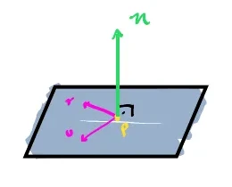

# Planes

Planes can be expressed as 2 lines (two individual vector parameters, $\mathbf{u}$ and $\mathbf{v}$) that form a 2D plane.

---

## Parametric Planes

Planes can be represented as:

$$
Q(s, t) = \mathbf{p} + s\mathbf{u} + t\mathbf{v}
$$

where:
* **$\mathbf{p}$** is the starting position.
* **$\mathbf{u}$ and $\mathbf{v}$** are 2 non-parallel direction vectors lying flat on the plane.
* **$s$** controls how far to move in the direction of $\mathbf{u}$.
* **$t$** controls how far to move in the direction of $\mathbf{v}$.

---

## Implicit Planes

Since $\mathbf{u}$ and $\mathbf{v}$ vectors lie in the same plane, we can calculate their [[04_Cross_Product|cross product]] to extract a normal vector $\mathbf{n}$ of the plane itself:

$$
\mathbf{n} = \mathbf{u} \times \mathbf{v}
$$

	

Given $\mathbf{n}$, a plane origin $\mathbf{q}$ (constant), and a point $\mathbf{p}$ inside the plane, we can assume that:

$$
\mathbf{n} \cdot (\mathbf{p} - \mathbf{q}) = 0
$$

We can rewrite it by expanding:

$$
(\mathbf{n} \cdot \mathbf{p}) + (-\mathbf{n} \cdot \mathbf{q}) = 0
$$

Because the result of $(-\mathbf{n} \cdot \mathbf{q})$ will always be constant (since $\mathbf{q}$ is a constant value for the plane), we can substitute it for $d$:

$$
\mathbf{n} \cdot \mathbf{p} + d = 0
$$

Since $\mathbf{n}$ is constituted of $n_x, n_y, n_z$, we can then compact it into a 4D vector (including $d$):

$$
\mathbf{f} = (n_x, n_y, n_z, d)
$$

and then finally use it to rewrite our plane formula as:

$$
\mathbf{f} \cdot \mathbf{p} = 0
$$

For this to work, we need also to convert $\mathbf{p}$ into a 4D vector and append $1$ to its 4th component:

$$
\mathbf{f} \cdot \mathbf{p} = (n_x p_x) + (n_y p_y) + (n_z p_z) + (d \cdot 1) = 0
$$

---

## Code Implementation

* **C++ Source Code:** [[03_Code/05_Geometry/Planes.cppm|Planes.cppm]]
