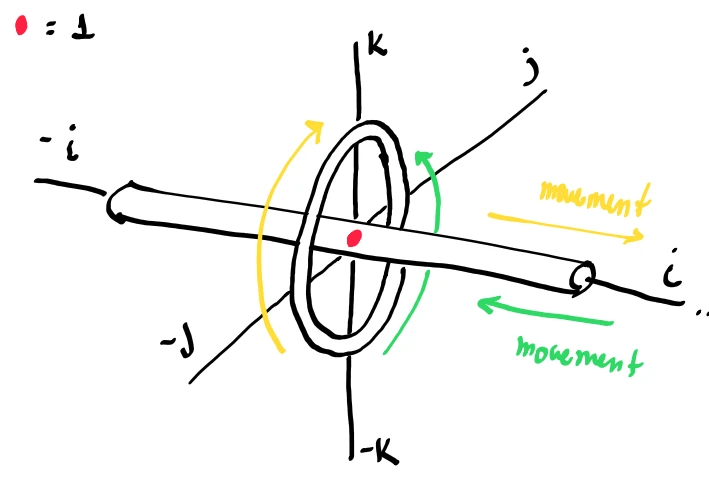

# Solution: Quaternion Intuition

This solution note provides the step-by-step mathematical derivations, projection mappings, and conceptual answers for the quaternion intuition exercise.

---

## Part 1: Calculation

### 1. Verifying Unit Magnitude

Given the point $q = 0.6 + 0.48i + 0.64j$, its magnitude $\Vert q \Vert$ is calculated as:

$$
\Vert q \Vert = \sqrt{w^2 + x^2 + y^2}
$$

$$
\Vert q \Vert = \sqrt{(0.6)^2 + (0.48)^2 + (0.64)^2}
$$

$$
\Vert q \Vert = \sqrt{0.36 + 0.2304 + 0.4096}
$$

$$
\Vert q \Vert = \sqrt{1.0} = 1
$$

Since the magnitude is exactly $1$, $q$ is a unit quaternion representing a point on the unit sphere $S^2$.

### 2. Stereographic Projection Calculation

Using the South Pole $S = -1$ (i.e. $w = -1, x = 0, y = 0$) as the projection source, the formula for the projection $p$ onto the 2D $ij$-plane ($w = 0$) is:

$$
p = \frac{x}{w + 1}i + \frac{y}{w + 1}j
$$

Substitute the given coordinates ($w = 0.6, x = 0.48, y = 0.64$):

$$
p = \frac{0.48}{0.6 + 1}i + \frac{0.64}{0.6 + 1}j
$$

$$
p = \frac{0.48}{1.6}i + \frac{0.64}{1.6}j
$$

$$
p = 0.3i + 0.4j
$$

### 3. Region Mapping Check

To determine whether the projected point $p = 0.3i + 0.4j$ lies inside or outside the equator unit circle in the $ij$-plane, we compute its magnitude $\Vert p \Vert$:

$$
\Vert p \Vert = \sqrt{(0.3)^2 + (0.4)^2} = \sqrt{0.09 + 0.16} = \sqrt{0.25} = 0.5
$$

Since $\Vert p \Vert = 0.5 < 1$, the projected point lies **inside** the equator unit circle.

**Explanation based on $w$:**
The real component of $q$ is $w = 0.6$. Because $w > 0$, the point lies in the **Northern Hemisphere** of the sphere. Under stereographic projection from the South Pole:
- Points with $w > 0$ (Northern Hemisphere) scale by $\frac{1}{w+1} < 1$, compressing them to map strictly **inside** the unit circle.
- Points with $w = 0$ (Equator) map exactly **on** the unit circle.
- Points with $w < 0$ (Southern Hemisphere) scale by $\frac{1}{w+1} > 1$, stretching them to map **outside** the unit circle.

Since our point has $w = 0.6 > 0$, it maps inside the unit circle as expected.

### 4. South Pole Projection

Direct algebraic substitution of the South Pole coordinates ($w = -1$, $x = 0$, $y = 0$) into the stereographic projection formula:

$$
p = \frac{x}{w + 1}i + \frac{y}{w + 1}j
$$

yields:

$$
p = \frac{0}{-1 + 1}i + \frac{0}{-1 + 1}j = \frac{0}{0}i + \frac{0}{0}j
$$

This is an indeterminate form ($0/0$), meaning direct substitution is undefined. To determine where the South Pole projects, we look at the limit of the projection magnitude as a point on the sphere approaches the South Pole.

Every point on the 3D unit sphere satisfies $w^2 + x^2 + y^2 = 1$, which implies $x^2 + y^2 = 1 - w^2$. The magnitude of the projected point in the plane, written as $\Vert p \Vert$, is:

$$
\Vert p \Vert = \sqrt{\left(\frac{x}{w + 1}\right)^2 + \left(\frac{y}{w + 1}\right)^2} = \frac{\sqrt{x^2 + y^2}}{w + 1}
$$

Substituting $x^2 + y^2 = 1 - w^2$:

$$
\Vert p \Vert = \frac{\sqrt{1 - w^2}}{w + 1} = \frac{\sqrt{(1 - w)(1 + w)}}{\sqrt{(w + 1)^2}} = \frac{\sqrt{1 - w}}{\sqrt{w + 1}}
$$

Taking the limit as the point approaches the South Pole ($w \to -1^+$):

$$
\lim_{w \to -1^+} \Vert p \Vert = \lim_{w \to -1^+} \frac{\sqrt{1 - w}}{\sqrt{w + 1}} = \frac{\sqrt{2}}{0^+} = \infty
$$

Thus, the South Pole projects to **infinity** ($\infty$).

**Geometric Intuition:**
Stereographic projection works by drawing a line from the South Pole (the projection source) through a point on the sphere, and finding where it intersects the projection plane $w = 0$. 

If the point on the sphere is the South Pole itself, the line is tangent to the sphere. The tangent plane at the South Pole is the plane $w = -1$, which is parallel to the projection plane $w = 0$. Because parallel planes never intersect in finite space, the South Pole projects to the **point at infinity**.

---

## Part 2: Conceptual Understanding

### 1. Hypersphere Regions Mapping in 3D Space

Under stereographic projection from the South Pole $w = -1$, the regions of the 4D unit hypersphere $S^3$ project into our 3D space as follows:

*   **The 3D Equator ($w = 0$):** Maps exactly to the **3D unit sphere** ($x^2 + y^2 + z^2 = 1$) in our 3D world.
*   **The Hyper-hemisphere containing the North Pole $+1$ ($w > 0$):** Maps **inside** the 3D unit sphere in our 3D world (with the North Pole itself mapping to the origin).
*   **The Hyper-hemisphere containing the South Pole $-1$ ($w < 0$):** Maps **outside** the 3D unit sphere in our 3D world (with the South Pole itself mapping to infinity).

### 2. Projected 4D Rotation Flow

A 4D rotation by the imaginary unit $i$ (pre-multiplying a quaternion $p$ by $i$) projects to our 3D space as a combination of two distinct geometric behaviors:

1.  **Along the $i$-axis (Real $w$ and Imaginary $i$ components):**
    Pre-multiplying by $i$ rotates points in the $wi$-plane:

$$
i \cdot 1 = i, \quad i \cdot i = -1
$$

    In the projected 3D space, this rotation maps to a **continuous linear wrapping flow** along the horizontal $i$-axis. As $i$ rotates:
    - A point starting at the origin (projection of $+1$) flows along the positive $i$-axis to $i$.
    - As it continues rotating toward $-1$, it stretches to infinity ($+\infty$), wraps around to $-\infty$, and flows back through $-i$ to return to the origin.
    
2.  **In the perpendicular $jk$-plane (Imaginary $j$ and $k$ components):**
    Pre-multiplying by $i$ rotates points in the $jk$-plane:

$$
i \cdot j = k, \quad i \cdot k = -j
$$

    In the projected 3D space, this is a **pure 2D rotation** of the $jk$-plane around the $i$-axis by $90^\circ$ without any warping or stretching.

  <!-- Placeholder for rotation flow diagram: rotation_flow_i.webp -->
  

### 3. Rotation Axis Normalization

Given the unnormalized 3D rotation axis:

$$
\vec{u}_{\text{raw}} = \begin{bmatrix} -2 \\\\ 2 \\\\ -1 \end{bmatrix}
$$

*   **Magnitude of $\vec{u}_{\text{raw}}$:**

$$
\|\vec{u}_{\text{raw}}\| = \sqrt{\sum_{i=1}^3 u_{\text{raw},i}^2} = \sqrt{(-2)^2 + 2^2 + (-1)^2} = \sqrt{4 + 4 + 1} = \sqrt{9} = 3
$$

*   **Normalized Unit Vector $\vec{u}$:**

$$
\vec{u} = \frac{\vec{u}_{\text{raw}}}{\|\vec{u}_{\text{raw}}\|} = \frac{1}{3} \begin{bmatrix} -2 \\\\ 2 \\\\ -1 \end{bmatrix} = \begin{bmatrix} -2/3 \\\\ 2/3 \\\\ -1/3 \end{bmatrix} \approx \begin{bmatrix} -0.67 \\\\ 0.67 \\\\ -0.33 \end{bmatrix}
$$

---
**Back to Question:** [[Q_09_Quaternion_Intuition]] | **Related Concepts:** [[09_Quaternion_Intuition]]
