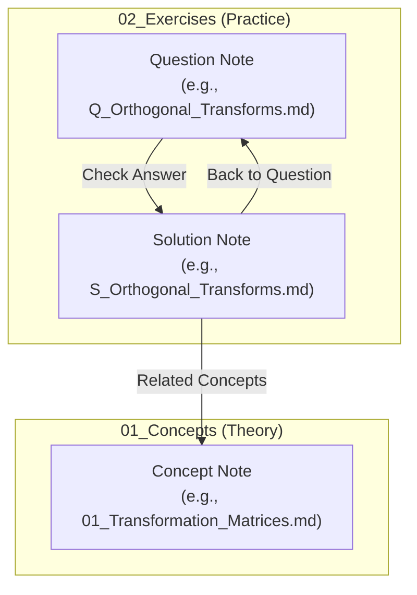

# Linear Algebra Study Repository

Welcome to your personal Linear Algebra study repository and knowledge base! 

This repository is designed to integrate seamlessly with **Obsidian**, utilizing cross-links (`[[Internal Link]]`) and tags to build a visual, highly connected graph of theoretical concepts, programming implementations, and practice exercises.

---

## Repository Structure

The workspace is organized into modular directories with numbered prefixes to maintain a structured order in your file explorer:

```text
Linear Algebra/
├── 01_Concepts/               # Theoretical notes organized by mathematical topics
│   ├── 01_Systems_of_Equations/
│   ├── 02_Vectors/            # e.g., Dot Product, Cross Product, Projections
│   ├── 03_Matrices/
│   └── 04_Transforms/         # e.g., Rotations, Reflections, Similarity Transforms
├── 02_Exercises/              # Practical questions and complete step-by-step solutions
│   ├── 01_Systems_of_Equations/
│   │   ├── Questions/         # md files named: Q_[Exercise_Name].md
│   │   └── Solutions/         # md files named: S_[Exercise_Name].md
│   ├── 02_Vectors/
│   ├── 03_Matrices/
│   └── 04_Transforms/
├── 03_Code/                   # (Optional) Code implementations (C++, Python, etc.)
├── 99_Templates/              # Templates for new Questions and Solutions
│   ├── Template_Question.md
│   └── Template_Solution.md
├── Raw Anotations/            # Unorganized scratch notes, screenshots, or raw imports
├── randomizer.py              # CLI tool to filter questions and scaffold new ones
├── README_Randomizer.md       # Help/Documentation for the CLI tool
└── README.md                  # This repository-level overview
```

---

## Knowledge Graph & Linking Philosophy

To maximize active recall and build a semantic understanding of Linear Algebra, this vault employs a strict **bi-directional linking strategy**:



1. **Question notes (`Q_*.md`)** contain the problem statement (both numerical calculations and conceptual theory in LaTeX). They end with a link to their corresponding solution:
   ```markdown
   **Check Answer:** [[S_Angle_Dot_Product]]
   ```
2. **Solution notes (`S_*.md`)** contain complete, step-by-step mathematical derivations in LaTeX, and an optional code snippet. They link back to the question and **point to the theoretical concept note** in `01_Concepts/`:
   ```markdown
   **Back to Question:** [[Q_Angle_Dot_Product]] | **Related Concepts:** [[02_Dot_Product]]
   ```
3. **Obsidian Graph View:** This linking strategy ensures that as you practice, all solved problems form "clusters" around their core mathematical concepts, highlighting which areas you've practiced most and creating a physical web of your knowledge.

---

## Daily Workflow

Here is how to get the most out of your repository on a daily basis:

### 1. Daily Practice Session
Spend 15–30 minutes a day solving random exercises using the `randomizer.py` tool.

1. Generate a workspace for today's practice:
   ```bash
   python3 randomizer.py -n 3 --practice
   ```
2. Open **Obsidian** and open the newly created [Daily_Practice.md](file:///home/aper/Documents/Linear%20Algebra/Daily_Practice.md) in your root folder.
3. Because of **transclusions (`![[Q_...]]`)**, you will see all 3 questions rendered inline inside the single daily practice note!
4. Write down your solutions on paper or scratchpad, then click the **Check Answer** links to instantly verify your derivations.
5. Delete or commit `Daily_Practice.md` when done.

### 2. Expanding the Repository (Adding Questions)
When you study a new topic or find a good textbook exercise, add it to your database using the CLI scaffolder:

1. Scaffold a question-solution pair under a topic folder:
   ```bash
   python3 randomizer.py vectors --new Projection_Properties --difficulty Medium
   ```
2. Open the new files inside Obsidian (they are pre-filled with frontmatter and bi-directional links).
3. Fill in the exercise description in the **Question** note, and write the mathematical steps in the **Solution** note.
4. Link the solution to its theory concept (e.g. `[[06_Vector_Projection]]`) to bind it to your knowledge graph.
